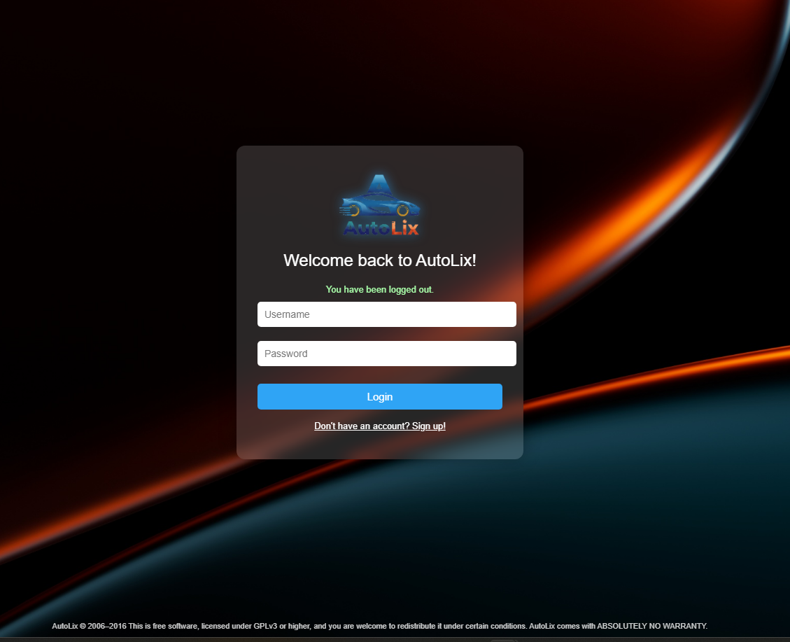
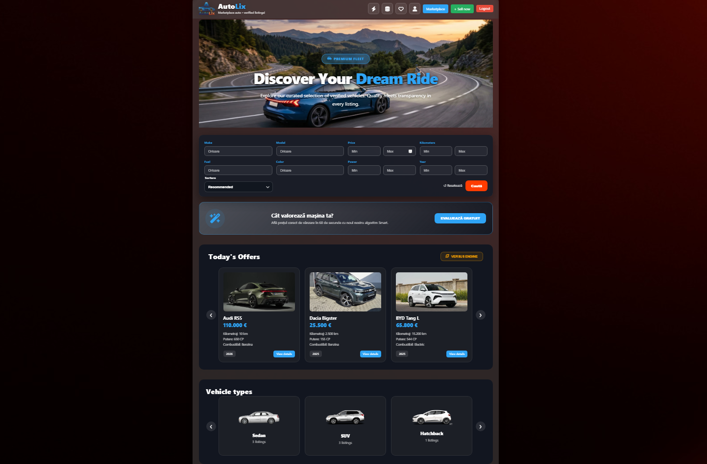
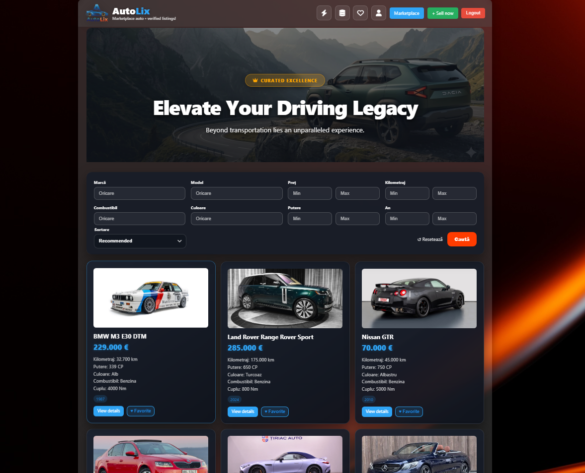
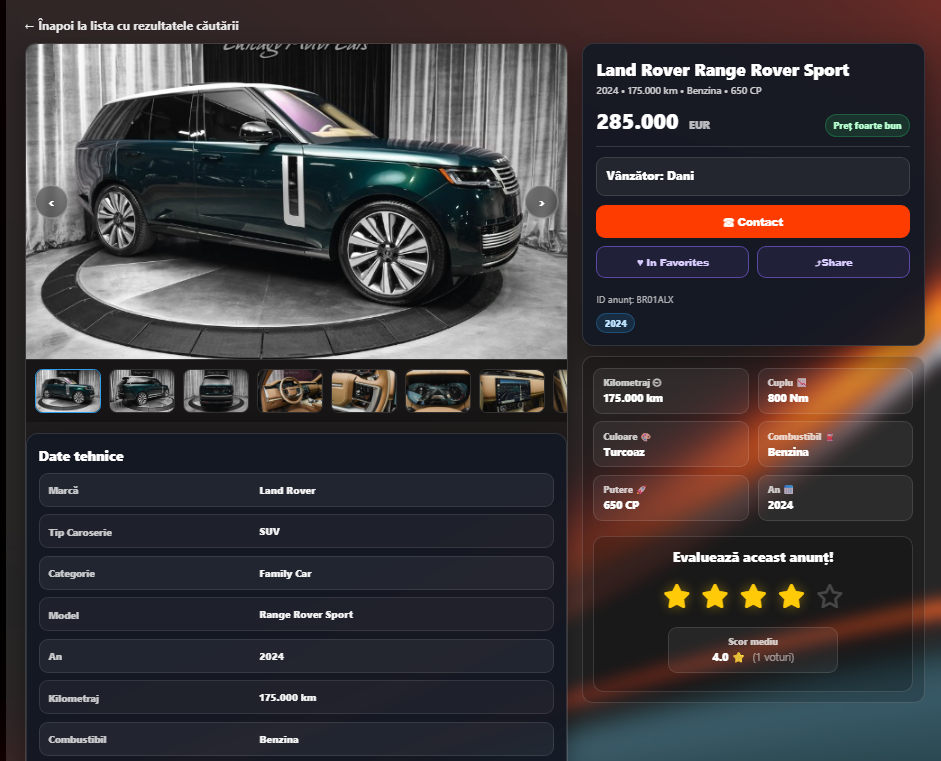
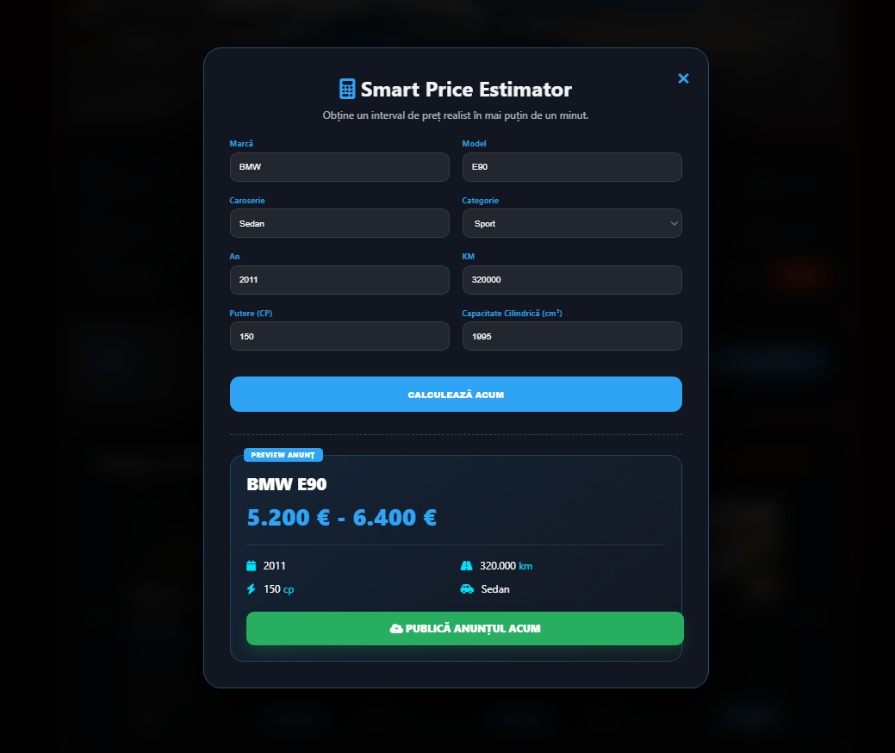
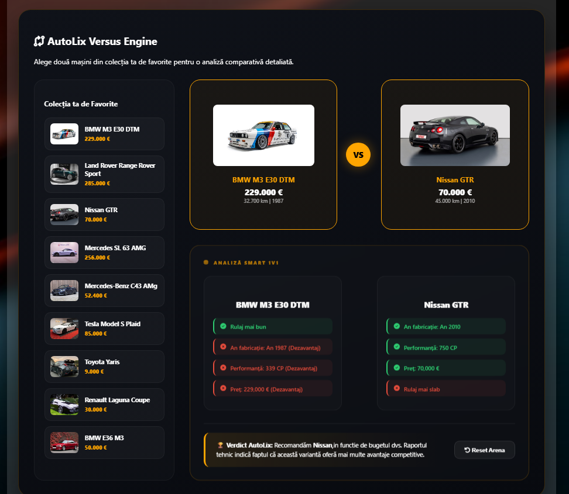
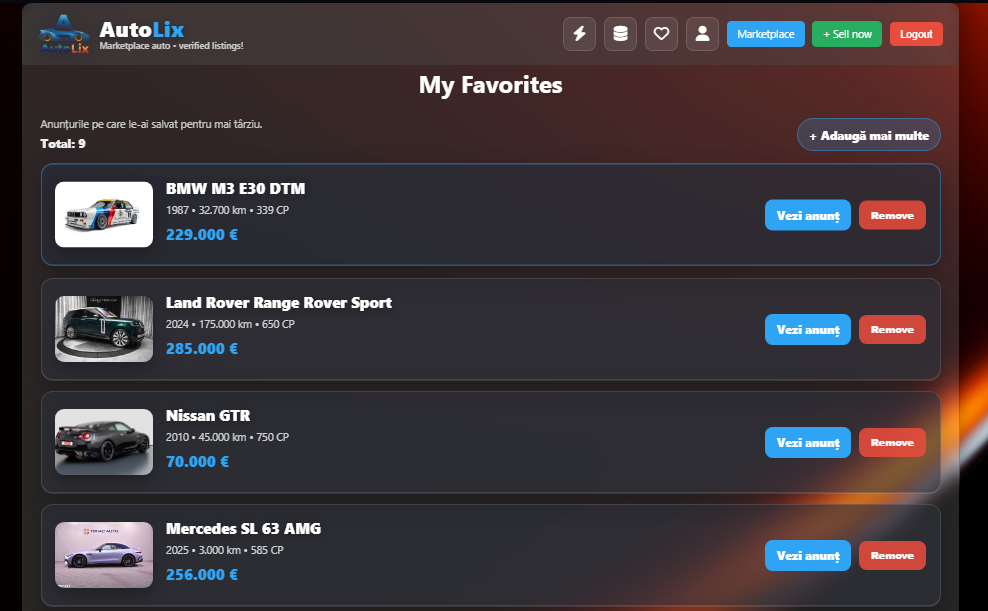
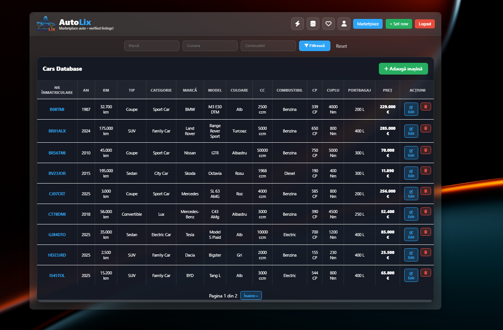

<div align="center">

<br/>


<br/>

**A full-stack verified car marketplace — browse, list, compare & evaluate vehicles with confidence.**

<br/>

[](https://www.java.com)
[](https://spring.io/projects/spring-boot)
[](https://www.thymeleaf.org)
[](https://www.mysql.com)
[](https://spring.io/projects/spring-security)
[](https://www.gnu.org/licenses/gpl-3.0)

<br/>

[🚀 Quick Start](#-quick-start) · [✨ Features](#-features) · [🛠️ Tech Stack](#%EF%B8%8F-tech-stack) · [📂 Structure](#-project-structure) · [🔐 Security](#-security) · [🌐 Routes](#-key-routes)

<br/>

---

</div>

## 🚗 What is AutoLix?

**AutoLix** is a full-stack car marketplace web application built with **Spring Boot** and **Thymeleaf**. It enables users to browse verified vehicle listings, post their own ads with AI-assisted price estimation, compare cars head-to-head, and track favorites — all within a sleek dark-themed UI.

Whether you're a buyer hunting your next dream ride or a seller looking to get the best value, AutoLix provides tools that go far beyond a typical classifieds site.

---

## ✨ Features

### 🔐 Login & Authentication
Secure login screen with branded background. Supports registration via the Sign Up flow.

<div align="center">

</div>

<br/>

---

### 🏠 Homepage & Discovery
- Dynamic hero banner with curated vehicle spotlights.
- **Today's Offers** — rotating carousel of the freshest listings.
- **Vehicle Types** browser — filter by Sedan, SUV, Hatchback, Coupe, and more.
- Smart search bar with multi-parameter filtering: brand, model, price range, mileage, fuel, color, power, year.

<div align="center">

</div>

<br/>

---

### 🛒 Marketplace
- Paginated, filterable vehicle grid with full card previews.
- Price quality indicator *(e.g., "Preț foarte bun")*.
- One-click **Favorites** toggle directly from listing cards.

<div align="center">

</div>

<br/>

---

### 📋 Listing Detail Page
- Full image gallery with thumbnail navigation.
- Complete technical specs table (brand, body type, year, KM, fuel, power, torque, color).
- Seller info card with contact button.
- Star rating system with average score display.
- Price badge with quality indicator.

<div align="center">

</div>

<br/>

---

### 💰 Smart Price Estimator
Enter your car's details and get a realistic market price range in under a minute.

```
Brand: BMW        Model: E90
Body:  Sedan      Category: Sport
Year:  2011       KM: 320.000
Power: 150 CP     Engine: 1995 ccm
```

```
💡 Estimated Price Range
────────────────────────────
  5.200 € — 6.400 €
────────────────────────────
  ✅ Ready to publish your listing
```

<div align="center">

</div>

<br/>

---

### ⚔️ AutoLix Versus Engine
- Side-by-side comparison of any two vehicles from your Favorites.
- Automatic **pro/con breakdown** per car: mileage, year, power, price.
- **AutoLix Verdict** — smart recommendation based on technical metrics.
- Reset the arena and pick new contenders anytime.

<div align="center">

</div>

<br/>

---

### ❤️ My Favorites
- Persistent favorites list tied to your account.
- Saved listings with thumbnail, key specs, and price at a glance.
- Direct links to the full listing or one-click removal.

<div align="center">

</div>

<br/>

---

### 🗄️ Cars Database *(Admin)*
- Full **CRUD interface** for the vehicle inventory.
- Filter by brand, color, and fuel type.
- Paginated data table with all technical fields.
- Inline **Edit** and **Delete** actions per record.

<div align="center">

</div>

<br/>

---

## 🛠️ Tech Stack

| Layer | Technology | Purpose |
|-------|-----------|---------|
| **Backend** | Java 17+, Spring Boot 3.x | Core application logic & REST/MVC controllers |
| **Templating** | Thymeleaf | Server-side HTML rendering |
| **ORM** | Spring Data JPA / Hibernate | Database entities & queries |
| **Security** | Spring Security + BCrypt | Auth, roles, CSRF protection |
| **Database** | MySQL 8.0+ | Relational data storage |
| **Build** | Maven | Dependency management & packaging |
| **Frontend** | HTML5, CSS3, JavaScript | UI layout, animations, interactivity |
| **File Storage** | Local filesystem (`/uploads`) | Vehicle image management |

---

## 🚀 Quick Start

### Prerequisites

- Java 17+
- Maven 3.8+
- MySQL 8.0+
- Git

### 1 · Clone the Repository

```bash
git clone https://github.com/your-username/autolix.git
cd autolix
```

### 2 · Configure the Database

Create a MySQL database, then update `src/main/resources/application.properties`:

```properties
spring.datasource.url=jdbc:mysql://localhost:3306/autolix_db
spring.datasource.username=YOUR_DB_USER
spring.datasource.password=YOUR_DB_PASSWORD

spring.jpa.hibernate.ddl-auto=update
spring.jpa.show-sql=false

spring.servlet.multipart.max-file-size=10MB
spring.servlet.multipart.max-request-size=10MB
```

### 3 · Seed Initial Data *(Optional)*

An initial dataset is available at `src/main/resources/data.sql`. To auto-execute on startup, add:

```properties
spring.sql.init.mode=always
```

### 4 · Build & Run

```bash
mvn clean install
mvn spring-boot:run
```

The application starts at:

```
http://localhost:8080
```

> ⚠️ Default admin credentials are set in `DataInitializer.java`. Change them immediately after first login.

---

## 📂 Project Structure

```
autolix/
│
├── src/main/java/com/example/demo/
│   ├── config/
│   │   └── WebConfig.java
│   ├── controller/
│   │   ├── AdminController.java
│   │   ├── AnalyticsController.java
│   │   ├── AuthController.java
│   │   ├── EstimateController.java
│   │   ├── FavoriteController.java
│   │   ├── HomepageController.java
│   │   ├── MasinaController.java
│   │   └── RatingController.java
│   ├── dto/
│   │   ├── EditProfileForm.java
│   │   └── SignUpForm.java
│   ├── entity/
│   │   ├── Favorite.java
│   │   ├── Masina.java
│   │   ├── Rating.java
│   │   └── Utilizator.java
│   ├── repository/
│   │   ├── FavoriteRepository.java
│   │   ├── MasinaRepository.java
│   │   ├── RatingRepository.java
│   │   └── UtilizatorRepository.java
│   ├── security/
│   └── service/
│       ├── DataInitializer.java
│       ├── FavoriteService.java
│       └── FileStorageService.java
│
├── src/main/resources/
│   ├── static/images/
│   │   ├── brands/
│   │   ├── css/
│   │   ├── types/
│   │   └── uploads/
│   ├── templates/
│   │   ├── fragments/
│   │   ├── homepage.html
│   │   ├── marketplace.html
│   │   ├── listing.html
│   │   ├── favorites.html
│   │   ├── estimator.html
│   │   ├── masini.html
│   │   ├── analytics.html
│   │   ├── login.html
│   │   ├── signup.html
│   │   └── ...
│   ├── application.properties
│   └── data.sql
│
├── docs/
│   └── screenshots/
│       ├── login.png
│       ├── home.png
│       ├── market.png
│       ├── rating.png
│       ├── price.png
│       ├── versus.png
│       ├── favorite.png
│       └── analists.png
│
├── uploads/
├── pom.xml
└── README.md
```

---

## 🔐 Security

AutoLix uses **Spring Security** for authentication and authorization:

- Passwords hashed with **BCrypt**
- Session-based authentication
- Role-based route protection: `ROLE_USER` and `ROLE_ADMIN`
- CSRF protection enabled by default
- Unauthorized access redirects to a custom `access-denied.html` page

---

## 🌐 Key Routes

| Route | Description | Access |
|-------|-------------|--------|
| `GET /` | Homepage | Public |
| `GET /marketplace` | Browse all listings | Public |
| `GET /listing/{id}` | Vehicle detail page | Public |
| `GET /favorites` | Saved favorites | Authenticated |
| `GET /estimator` | Smart Price Estimator | Authenticated |
| `GET /versus` | Versus Engine | Authenticated |
| `GET /masini` | Cars Database | Admin |
| `GET /admin` | Admin panel | Admin |
| `GET /analytics` | Platform analytics | Admin |
| `POST /masini/add` | Add new listing | Admin |
| `POST /masini/edit/{id}` | Edit listing | Admin |
| `DELETE /masini/{id}` | Delete listing | Admin |
| `GET /login` | Login page | Public |
| `GET /signup` | Registration page | Public |

---

## 🗺️ Roadmap

- [ ] Real-time chat between buyer and seller
- [ ] Advanced analytics with charts & trends
- [ ] Email notifications for saved search alerts
- [ ] Mobile-responsive redesign
- [ ] Vehicle history report integration
- [ ] Multi-image upload with drag & drop reorder

---

## 🤝 Contributing

Contributions, issues and feature requests are welcome!

1. Fork the repository
2. Create your branch: `git checkout -b feature/my-feature`
3. Commit your changes: `git commit -m "feat: add my feature"`
4. Push and open a PR: `git push origin feature/my-feature`

Please follow [Conventional Commits](https://www.conventionalcommits.org/) for commit messages.

---

## 📜 License

```
AutoLix © 2006–2016
This is free software, licensed under GPLv3 or higher.
You are welcome to redistribute it under certain conditions.
AutoLix comes with ABSOLUTELY NO WARRANTY.
```

See [`LICENSE`](LICENSE) for the full text.

---

<div align="center">

<br/>

Built with ☕ Java · 🌿 Spring Boot · 🚗 AutoLix Team

*Marketplace auto • verified listings*

<br/>

**[⭐ Star this repo](https://github.com/your-username/autolix)** if you found it useful!

</div>
